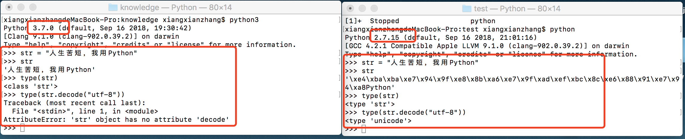

# Python2.x与Python3.x
参考文档：

[Python官方文档](https://docs.python.org/3/whatsnew/3.0.html)

[使用2to3移植代码](https://woodpecker.org.cn/diveintopython3/porting-code-to-python-3-with-2to3.html)

What are the differences?
Short version: Python 2.x is legacy, Python 3.x is the present and future of the language
Python 3.0 was released in 2008. The final 2.x version 2.7 release came out in mid-2010, with a statement of extended support for this end-of-life release. The 2.x branch will see no new major releases after that. 3.x is under active development and has already seen over five years of stable releases, including version 3.3 in 2012, 3.4 in 2014, and 3.5 in 2015. This means that all recent standard library improvements, for example, are only available by default in Python 3.x.
Guido van Rossum (the original creator of the Python language) decided to clean up Python 2.x properly, with less regard for backwards compatibility than is the case for new releases in the 2.x range. The most drastic improvement is the better Unicode support (with all text strings being Unicode by default) as well as saner bytes/Unicode separation.
Besides, several aspects of the core language (such as print and exec being statements, integers using floor division) have been adjusted to be easier for newcomers to learn and to be more consistent with the rest of the language, and old cruft has been removed (for example, all classes are now new-style, "range()" returns a memory efficient iterable, not a list as in 2.x).
The What's New in Python 3.0 document provides a good overview of the major language changes and likely sources of incompatibility with existing Python 2.x code. Nick Coghlan (one of the CPython core developers) has also created a relatively extensive FAQ regarding the transition.
However, the broader Python ecosystem has amassed a significant amount of quality software over the years. The downside of breaking backwards compatibility in 3.x is that some of that software (especially in-house software in companies) still doesn't work on 3.x yet.

##常用接口

### 1.print函数

`print`语句没有了，取而代之的是`print()`函数。 Python 2.6与Python 2.7部分地支持这种形式的print语法。在Python 2.6与Python 2.7里面，以下三种形式是等价的：
```
print "xxz"
print ("xxz") #注意print后面有个空格
print("xxz")
```
Python 2.6实际已经支持新的print()语法

### Unicode

在这里先普及一个背景知识，在Python2中，默认的str并不是真正意义上的字符串，而是一个'''byte'''数组，或者说是一个ASCII的字符串,而真正意义上的字符串是unicode类型的变量，可以实现`decode`方法。





从上面两张图片可以看到，在Python2.7中直接输出一串中文就会显示它的“本性”。在Pyhon3中，区分为str何byte类型。我们在传输数据的时候，一般是先将`str`转换为`byte`类型，在接收数据的时候一般接收的都是`byte`类型，所以需要解码操作。最后，Python3默认使用`utf-8`编码。

### 除法运算

在Python2中，`/`除法得到的是一个保留整数的结果，人称”地板除法“。

```
>>> 10 / 3
3
```
而如果想要真除，有两种方式：

1.导入division模块
```
rom __future__ import division
>>> 7/3
2.3333333333333335
>>> 4/2
2.0
```
2.用浮点数代替整数进行运算
```
>>> 7/3.0
2.3333333333333335
>>> 7.0/3
2.3333333333333335
>>> 7.0/3.0
2.3333333333333335
>>>
```
需要注意的一点的是，浮点数精度的问题往往会导致意向不到的bug。

在Python3中对除法进行了优化。`/`就是代表真除，`//`代表了向下取整除法，`%`代表取模的除法（返回除法的余数）。
```
>>> 3/2
1.5
>>> 3 //2 
1
>>> 3 % 2
1
>>> 
```

最后，除了”地板除法“之外，还有”天花板除法“

```
>>> math.floor(3/2)
1.0
>>> math.ceil(1.5)
2.0
```

### 3.异常捕获

在Python2中，通常使用`except Exception,e`来捕获异常，还有`except (IOError ,ZeroDivisionError),e`来捕获一组异常。Python3中一般使用`except Exception as e`来捕获异常。

### 4.xrange()与range()

`xrange()`用法与`range()`用法差不多，区别在与`xrange()`返回的是一个生成器，而`range()`直接返回的一个列表。生成器不会一次性生成所有的数据，而是被调用一次生成一次，所以生成器非常节约空间，但与之相对应的是浪费时间（时间与空间不可兼得）。

### 5.
