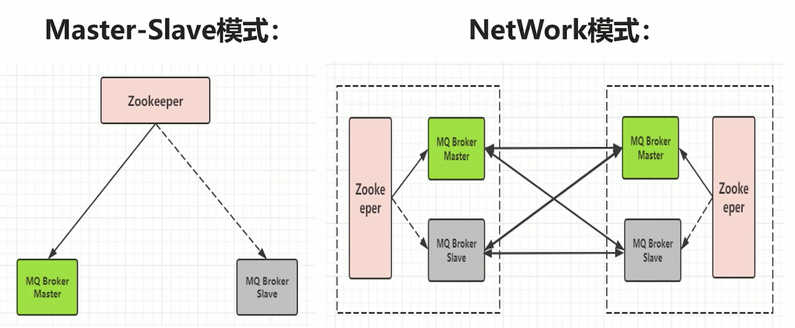
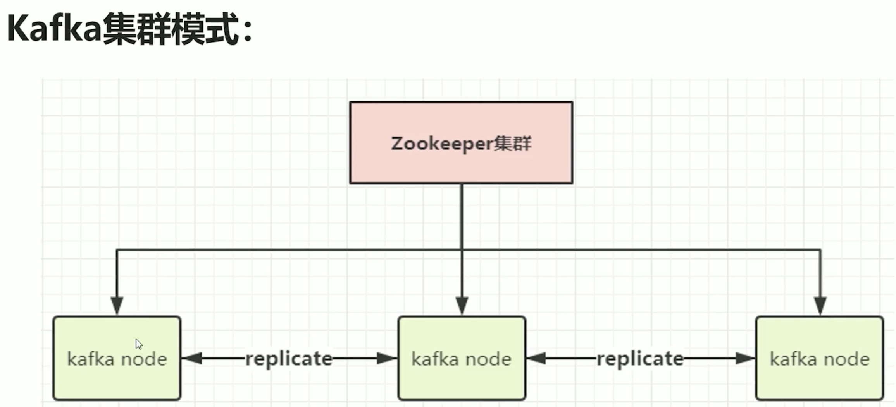
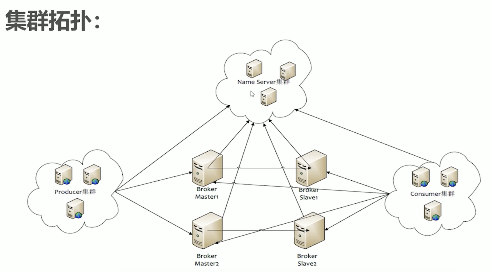
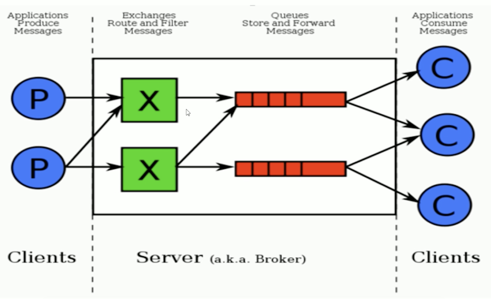
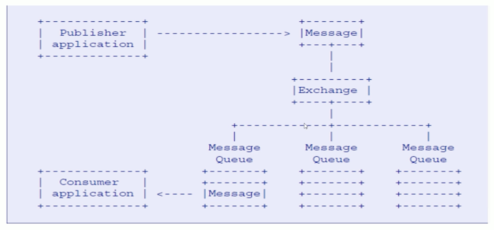
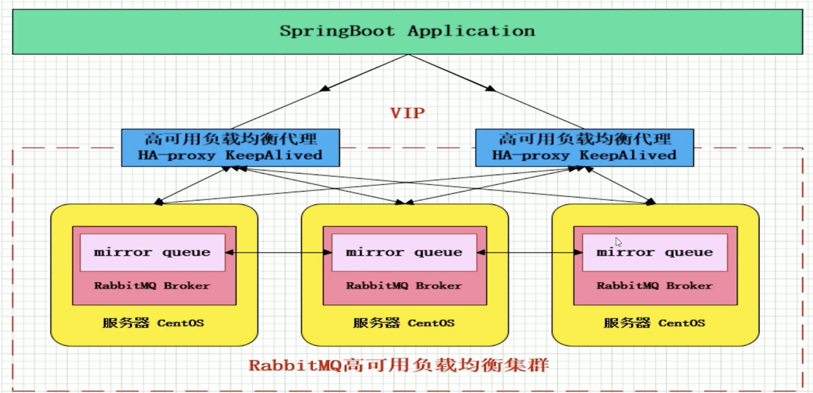

### 主流消息中间件介绍
#### ActiveMQ
ActiveMQ是Apache出品，最流行的，能力强劲的开源消息总线，并且他是一个完全支持JMS规范的消息中间件。其丰富的API、多种集群构建模式使得他成为业界老牌消息中间件，在中小型企业中应用广泛！
MQ衡量指标：服务性能、数据存储、集群架构
逐渐在被新型消息中间件替代，如果不是特别大的并发场景，Active模式也是一个很好的选择。其架构如下：



#### Kafka
Kafka是Linkedln开源分布式发布-订阅消息系统，目前归属于Apache顶级项目。Kafka主要特点是基于Pull模式来处理消息消费，追求高吞吐量，一开始就是为大数据设计，的目的就是用于日志收集和传输。0.8版本开始支持复制，不支持事务，对消息的重复、丢失、错误没有严格要求，基于内存，适合产生大量数据的互联网服务的数据收集业务。集群架构如下：



####RocketMQ
RocketMQ是阿里开源的消息中间件，目前也是Apache的顶级项目，纯Java开发，具有高吞吐量、高可用性、适合大规模分布式系统应用的特点。RocketMQ思路起源于Kafka，它对消息的可靠性传输及事务性做了优化，目前在阿里集团被广泛应用于交易、充值、流计算、消息推送、日志流式处理、binglog分发等场景。保证消息队列的顺序性，集群架构多维（1-1,1-n,n-n）,维护困难，商业版收费。及架构如下：



### RabbitMQ
#### RabbitMQ简介
RabbitMQ是一个开源的消息代理和队列服务器，用来通过普通协议在完全不同的应用之间共享数据，RabbitMQ是使用Erlang语言来编写的，并且RabbitMQ是基于AMQP协议的。
1.开源、性能优秀、稳定性保障、提供可靠性投递模式、返回模式
2.与springAMQP完美的整合，API丰富
3.集群模式丰富，支持表达式的配置，HA模式，镜像队列模式
4.保证数据不丢失的前提下做到高可靠性
AMQP高级消息队列协议：
AMQP定义：是具有现代特征的二进制协议。是一个提供统一消息服务的应用层标准高级消息队列协议，是应用层协议的一个开放标准，为面向消息的中间件设计。协议模型如下图：
AMQP的主要特征是面向消息、队列、路由（包括点对点和发布/订阅）、可靠性、安全，更多用在企业系统内，对数据一致性，稳定性和可靠性要求很高的场景，对性能和吞吐量的要求还在其次。
AMQP核心概念：
1.==Server==：又称Broker，接受客户端的链接，实现AMQP实体服务
2.==Connection==：连接，应用程序与Broker的网络连接
3.==Channel==：网络信道，几乎所有的操作都在Channel中进行，Channel是进行消息读写的通道，客户端可以建立多个Channel，每个Channel代表一个会话任务。
4.==Message==：消息，服务器和应用程序之间传送的数据，由Properties和Body组成。Properties可以对消息进行修饰，比如消息的优先级、延迟等高级特性；Body则就是消息体内容。
5.==Virtual Host==：虚拟地址，用于进行逻辑隔离，最上层的消息路由。一个Virtual Host里面可以有若干个Exchange或Queue，同一个Virtual Host里面不能有相同名车的Exchange或Queue
6.==Exchange==：交换机，接收消息，根据路由键转发消息到绑定的消息队列。
7.==Binding==:Exchange和Queue质检的虚拟连接，binding中可以包含routing key
8.==Routing key==：一个路由规则，虚拟机可用他来确定如何路由一个特定消息。
9.==Queue==：也称为Message Queue，消息队列，保存信息并将他们转发给消费者。
#### RabbitMQ整体架构
RabbitMQ整体架构如下图：

RabbitMQ消息流转图如下图：

RabbitMQ负载均衡集群如下图：
#### 安装启动RabbitMQ
1.安装：
在Mac下执行`brew install rabbitmq`，会自动安装rabbitmq和依赖的erlang语言。
```
==> Installing rabbitmq dependency: erlang
==> Downloading https://homebrew.bintray.com/bottles/erlang-21.2.4.high_sierra.b
######################################################################## 100.0%
==> Pouring erlang-21.2.4.high_sierra.bottle.tar.gz
==> Caveats
Man pages can be found in:
  /usr/local/opt/erlang/lib/erlang/man

Access them with `erl -man`, or add this directory to MANPATH.
==> Summary
🍺  /usr/local/Cellar/erlang/21.2.4: 5,684 files, 272.5MB
==> Installing rabbitmq
==> Downloading https://github.com/rabbitmq/rabbitmq-server/releases/download/v3
==> Downloading from https://github-production-release-asset-2e65be.s3.amazonaws
######################################################################## 100.0%
==> /usr/bin/unzip -qq -j /usr/local/Cellar/rabbitmq/3.7.11/plugins/rabbitmq_man
==> Caveats

```
2.配置环境变量：
执行：`export PATH=$PATH:/usr/local/sbin`
3.启动rabbitmq：
后台启动服务：`rabbitmq-server`
停止服务：`rabbitmqctl stop`
在浏览器窗口打开·ip:15672(默认端口)
4.常用命令行操作：

1.`rabbit-server`：启动服务

2.`rabbitmqctl stop`启动服务

3.`rabbitmqctl add_user username password`:添加用户

4.`rabbitmqctl list_users`:列出所有用户

5.`rabbitmqctl delete_user username`:删除用户

6.`rabbitmqctl clear_permissions -p vhostpath username`:清除用户权限

7.`rabbitmqctl list_user_permissions username`:列出用户权限

8.`rabbitmqctl change_password  username newpassword`:修改密码

9.`rabbitmqctl set_permission -p vhostpath username ".*" ".*" ".*"`:设置用户权限

10.`rabbitmqctl add_vhost vhostpath`:创建虚拟主机

11.`rabbitmqctl list_vhost`:列出所有虚拟主机

12.`rabbitmqctl list_permission -p vhostpath`:列出虚拟机主机上的所有权限

13.`rabbitmqctl delete_vhost vhostpath`:删除虚拟主机

14.`rabbitmqctl list_queues`:查看所有队列信息

15.`rabbitmqctl -p vhostpath purge_queue blue`:清除队列里的消息

16.`rabbitmq reset`:清除所有数据，在停止服务后才能执行

17.`rabbitmqctl join_cluster <clusternode> [---ram]`:组成集群命令
  
18.`rabbitmqctl cluster_status`:查看集群状态

19.`rabbitmqctl change_cluster_node_type disc | ram`:修改集群节点的存储形式

20.`rabbitmqctl forget_cluster_node [--offline]`:忘记节点（摘除节点）

21.`rabbitmqctl rename_cluster_node oldnode1 newnode1 [oldnode2] [newnode2...]（修改节点名称）`
### rabbitmq通过Python实现
#### part1 simple demo
##### send.py
！[](http://www.rabbitmq.com/img/tutorials/sending.png)
```
import pika

#建立与RabbitMQ服务器的连接
connection = pika.BlockingConnection(pika.ConnectionParameters('localhost'))
channel = connection.channel()

#在RabbitMQ中，消息永远不能直接发送到队列，而是先通过交换机,我们在这使用一种由空字符串标识的默认交换（允许准确地指定消息应该去哪个队列，需要在`routing_key`中指定队列名称）
channel.basic_publish(exchange='',routing_key='hello',body='Hello World！')
print(" [x] Sent 'Hello World!'")
#在退出程序之前，我们需要确保刷新网络缓冲区并且我们的消息实际上已传递给RabbitMQ。我们可以通过轻轻关闭连接来实现
connection.close()
```
##### receive.py

```
import pika

connection = pika.BlockingConnection(pika.ConnectionParameters(host='localhost'))
channel = connection.channel()

channel.queue_declare(queue='hello')


def callback(ch, method, properties, body):
    print(" [x] Received %r" % body)


channel.basic_consume(callback,
                      queue='hello',
                      no_ack=True)

print(' [*] Waiting for messages. To exit press CTRL+C')
channel.start_consuming() # 启动无限循环的监听

```
Part1简单说明了如何发送及接受消息。执行==receive.py==后可以看到：`[*] Waiting for messages. To exit press CTRL+C`，这意味着我们的RabbitMQ已经开始监听消息。此时执行==send.py==发送消息后可以在屏幕上看到` [*] Waiting for messages. To exit press CTRL+C
[x] Received b'Hello World\xef\xbc\x81'`
在终端上查看队列：
xiangxianzhangdeMacBook-Pro:sbin xiangxianzhang$ rabbitmqctl list_queues
Timeout: 60.0 seconds ...
Listing queues for vhost / ...
name	messages
hello	0```

```
