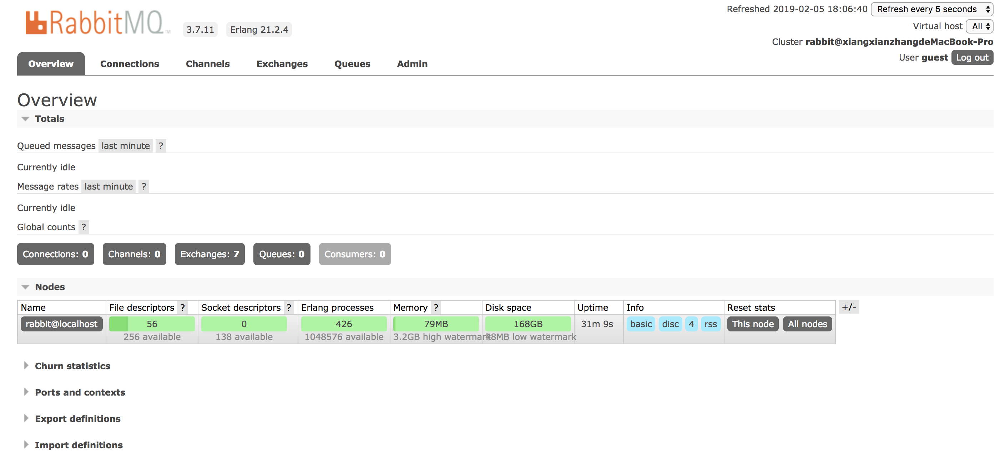

### 主流消息中间件介绍
#### ActiveMQ
ActiveMQ是Apache出品，最流行的，能力强劲的开源消息总线，并且他是一个完全支持JMS规范的消息中间件。其丰富的API、多种集群构建模式使得他成为业界老牌消息中间件，在中小型企业中应用广泛！

MQ衡量指标：服务性能、数据存储、集群架构
逐渐在被新型消息中间件替代，如果不是特别大的并发场景，Active模式也是一个很好的选择。其架构如下：


#### Kafka
Kafka是Linkedln开源分布式发布-订阅消息系统，目前归属于Apache顶级项目。Kafka主要特点是基于Pull模式来处理消息消费，追求高吞吐量，一开始就是为大数据设计，的目的就是用于日志收集和传输。0.8版本开始支持复制，不支持事务，对消息的重复、丢失、错误没有严格要求，基于内存，适合产生大量数据的互联网服务的数据收集业务。集群架构如下：


#### RocketMQ
RocketMQ是阿里开源的消息中间件，目前也是Apache的顶级项目，纯Java开发，具有高吞吐量、高可用性、适合大规模分布式系统应用的特点。RocketMQ思路起源于Kafka，它对消息的可靠性传输及事务性做了优化，目前在阿里集团被广泛应用于交易、充值、流计算、消息推送、日志流式处理、binglog分发等场景。保证消息队列的顺序性，集群架构多维（1-1,1-n,n-n）,维护困难，商业版收费。及架构如下：


### RabbitMQ
#### RabbitMQ简介
RabbitMQ是一个开源的消息代理和队列服务器，用来通过普通协议在完全不同的应用之间共享数据，RabbitMQ是使用Erlang语言来编写的，并且RabbitMQ是基于AMQP协议的.

1.开源、性能优秀、稳定性保障、提供可靠性投递模式、返回模式

2.与springAMQP完美的整合，API丰富

3.集群模式丰富，支持表达式的配置，HA模式，镜像队列模式

4.保证数据不丢失的前提下做到高可靠性

AMQP高级消息队列协议：

AMQP定义：是具有现代特征的二进制协议。是一个提供统一消息服务的应用层标准高级消息队列协议，是应用层协议的一个开放标准，为面向消息的中间件设计。协议模型如下图：


AMQP的主要特征是面向消息、队列、路由（包括点对点和发布/订阅）、可靠性、安全，更多用在企业系统内，对数据一致性，稳定性和可靠性要求很高的场景，对性能和吞吐量的要求还在其次。
AMQP核心概念：

1.**Server**：又称Broker，接受客户端的链接，实现AMQP实体服务

2.**Connection**：连接，应用程序与Broker的网络连接

3.**Channel**：网络信道，几乎所有的操作都在Channel中进行，Channel是进行消息读写的通道，客户端可以建立多个Channel，每个Channel代表一个会话任务。

4.**Message**：消息，服务器和应用程序之间传送的数据，由Properties和Body组成。Properties可以对消息进行修饰，比如消息的优先级、延迟等高级特性；Body则就是消息体内容。

5.**Virtual Host**：虚拟地址，用于进行逻辑隔离，最上层的消息路由。一个Virtual Host里面可以有若干个Exchange或Queue，同一个Virtual Host里面不能有相同名车的Exchange或Queue

6.**Exchange**：交换机，接收消息，根据路由键转发消息到绑定的消息队列。

7.**Binding**:Exchange和Queue质检的虚拟连接，binding中可以包含routing key

8.**Routing key**：一个路由规则，虚拟机可用他来确定如何路由一个特定消息。

9.**Queue**：也称为Message Queue，消息队列，保存信息并将他们转发给消费者。

#### RabbitMQ整体架构

RabbitMQ整体架构如下图：

RabbitMQ消息流转图如下图：

RabbitMQ负载均衡集群如下图：

#### 安装启动RabbitMQ

1.安装：
在Mac下执行`brew install rabbitmq`，会自动安装rabbitmq和依赖的erlang语言。
```
==> Installing rabbitmq dependency: erlang
==> Downloading https://homebrew.bintray.com/bottles/erlang-21.2.4.high_sierra.b
######################################################################## 100.0%
==> Pouring erlang-21.2.4.high_sierra.bottle.tar.gz
==> Caveats
Man pages can be found in:
  /usr/local/opt/erlang/lib/erlang/man

Access them with `erl -man`, or add this directory to MANPATH.
==> Summary
🍺  /usr/local/Cellar/erlang/21.2.4: 5,684 files, 272.5MB
==> Installing rabbitmq
==> Downloading https://github.com/rabbitmq/rabbitmq-server/releases/download/v3
==> Downloading from https://github-production-release-asset-2e65be.s3.amazonaws
######################################################################## 100.0%
==> /usr/bin/unzip -qq -j /usr/local/Cellar/rabbitmq/3.7.11/plugins/rabbitmq_man
==> Caveats

```
2.配置环境变量：

执行：`export PATH=$PATH:/usr/local/sbin`

3.启动rabbitmq：

后台启动服务：`rabbitmq-server`

停止服务：`rabbitmqctl stop`

在浏览器窗口打开`ip:15672(默认端口)`





4.常用命令行操作：
1.`rabbit-server`：启动服务

2.`rabbitmqctl stop`启动服务

3.`rabbitmqctl add_user username password`:添加用户

4.`rabbitmqctl list_users`:列出所有用户

5.`rabbitmqctl delete_user username`:删除用户

6.`rabbitmqctl clear_permissions -p vhostpath username`:清除用户权限

7.`rabbitmqctl list_user_permissions username`:列出用户权限

8.`rabbitmqctl change_password  username newpassword`:修改密码

9.`rabbitmqctl set_permission -p vhostpath username ".*" ".*" ".*"`:设置用户权限

10.`rabbitmqctl add_vhost vhostpath`:创建虚拟主机

11.`rabbitmqctl list_vhost`:列出所有虚拟主机

12.`rabbitmqctl list_permission -p vhostpath`:列出虚拟机主机上的所有权限

13.`rabbitmqctl delete_vhost vhostpath`:删除虚拟主机

14.`rabbitmqctl list_queues`:查看所有队列信息

15.`rabbitmqctl -p vhostpath purge_queue blue`:清除队列里的消息

16.`rabbitmq reset`:清除所有数据，在停止服务后才能执行

17.`rabbitmqctl join_cluster <clusternode> [---ram]`:组成集群命令

18.`rabbitmqctl cluster_status`:查看集群状态

19.`rabbitmqctl change_cluster_node_type disc | ram`:修改集群节点的存储形式

20.`rabbitmqctl forget_cluster_node [--offline]`:忘记节点（摘除节点）

21.`rabbitmqctl rename_cluster_node oldnode1 newnode1 [oldnode2] [newnode2...]（修改节点名称）`

### rabbitmq通过Python实现
#### part1 simple demo
##### send.py


```
import pika

# 建立与RabbitMQ服务器的连接
connection = pika.BlockingConnection(pika.ConnectionParameters('localhost'))
channel = connection.channel()

#在RabbitMQ中，消息永远不能直接发送到队列，而是先通过交换机,我们在这使用一种由空字符串标识的默认交换（允许准确地指定消息应该去哪个队列，需要在`routing_key`中指定队列名称）
channel.basic_publish(exchange='',routing_key='hello',body='Hello World！')
print(" [x] Sent 'Hello World!'")
# 在退出程序之前，我们需要确保刷新网络缓冲区并且我们的消息实际上已传递给RabbitMQ。我们可以通过轻轻关闭连接来实现
connection.close()
```
##### receive.py


```
import pika

connection = pika.BlockingConnection(pika.ConnectionParameters(host='localhost'))
channel = connection.channel()

channel.queue_declare(queue='hello')


def callback(ch, method, properties, body):
    print(" [x] Received %r" % body)


channel.basic_consume(callback,
                      queue='hello',
                      no_ack=True)

print(' [*] Waiting for messages. To exit press CTRL+C')
channel.start_consuming() # 启动无限循环的监听

```
Part1简单说明了如何发送及接受消息。执行==receive.py==后可以看到：`[*] Waiting for messages. To exit press CTRL+C`，这意味着我们的RabbitMQ已经开始监听消息。此时执行==send.py==发送消息后可以在屏幕上看到` [*] Waiting for messages. To exit press CTRL+C
[x] Received b'Hello World\xef\xbc\x81'`
在终端上查看队列：

```
xiangxianzhangdeMacBook-Pro:sbin xiangxianzhang$ rabbitmqctl list_queues
Timeout: 60.0 seconds ...
Listing queues for vhost / ...
name	messages
hello	0
```

#### part2 Work Queues


在这节中，我将发送代表复杂任务的字符串，我通过`time.sleep()`来伪造耗时任务。

##### new_task.py

稍微修改part1的send.py，以允许从命令行发送任意消息。
```
import sys

message = ' '.join(sys.argv[1:]) or "Hello World!"
channel.basic_publish(exchange='',
                      routing_key='hello',
                      body=message)
print(" [x] Sent %r" % message)
```
##### work.py
修改part1的receive.py，为消息体中的每个点伪造1s的耗时，它将从队列中弹出消息并执行任务。
```
import time

def callback(ch, method, properties, body):
    print(" [x] Received %r" % body)
    time.sleep(body.count(b'.'))
    print(" [x] Done")
```
##### 循环调度
使用任务队列的一个好处就是他可以==并行==地处理消息。如果我们的消息很多，那么我们可以添加更过的worker。下面我们将尝试同时运行两个worker，他们都会从队列中获取消息。

先发送五条消息：
```
xiangxianzhangdeMacBook-Pro:test xiangxianzhang$ python3 new_task.py 
 [x] Sent 'Hello World!'
xiangxianzhangdeMacBook-Pro:test xiangxianzhang$ python new_task.py First message.
 [x] Sent 'First message.'
xiangxianzhangdeMacBook-Pro:test xiangxianzhang$ python new_task.py Second message..
 [x] Sent 'Second message..'
xiangxianzhangdeMacBook-Pro:test xiangxianzhang$ python new_task.py Third message...
 [x] Sent 'Third message...'
xiangxianzhangdeMacBook-Pro:test xiangxianzhang$ python new_task.py Fourth message....
 [x] Sent 'Fourth message....'
xiangxianzhangdeMacBook-Pro:test xiangxianzhang$ python new_task.py Fifth message.....
 [x] Sent 'Fifth message.....'

```
下面看两个worker是如何接收消息的
Worker1：
```
 [*] Waiting for messages. To exit press CTRL+C
 [x] Received b'Second message..'
 [x] Done
 [x] Received b'Fourth message....'
 [x] Done

```
Worker2:
```
 [*] Waiting for messages. To exit press CTRL+C
 [x] Received b'First message.'
 [x] Done
 [x] Received b'Third message...'
 [x] Done
 [x] Received b'Fifth message.....'
 [x] Done
```
默认情况下，RabbitMQ会按顺序将每条消息发送给下一个消费者，平均而言，每个消费者将获得相同数量的消息。这种分发消息的方式称为==循环法==。

##### 消息确认(message acknowledgments)

我们现在完成的代码可以做到分发消息，但是有一个缺陷，一旦RabbitMQ向消客户发送消息，它将立即将其标记为删除，在这种情况下，如果一个worker停止工作了，将会丢失它刚刚处理的消息，还将丢失分发但尚未处理的所有给这个特定worker的消息。

所以我们在一个worker停止工作的时候，要做好工作交接，确保不会丢失任何消息。

为了确保消息永不丢失，RabbitMQ支持消息确认，消费者返回==ack==(nowledgement)告诉RabbitMQ已收到，处理了这条消息，RabbitMQ可以自由删除它。如果消费者死亡（其通道关闭，连接关闭或者TCP连接丢失）而不能发送回执，RabbitMQ将未完全处理的消息排队并重新排队，如果同时有其他在线消费者，则会迅速将其重新发送给其他消费者。这样就可以确保没有消息丢失。

消息不会超时，当消费者死亡时，RabbitMQ将重新发送消息，即使处理消息需要非常长的时间，也没有关系。
默认情况下，手动消息确认已打开。在前面的示例中，我们通过`no_ack = True`标志明确地将它们关闭。在我们完成任务后，是时候删除此标志并从工作人员发送适当的确认。
```
def callback(ch, method, properties, body):
    print " [x] Received %r" % (body,)
    time.sleep( body.count('.') )
    print " [x] Done"
    ch.basic_ack(delivery_tag = method.delivery_tag)#RabbitMQ will eat more and more memory as it won't be able to release any unacked messages if miss the basic_ack

channel.basic_consume(callback,
                      queue='hello')
```
使用这份代码，即使使用`CTRL+C`来终止worker的工作，也不会有任何的消息丢失，没有回执的消息会被重新分配。

#### 消息持久性

现在即使消费者死亡，我们的任务也不会丢失，但是如果RabbitMQ服务器宕机，我们的任务任然会丢失。所以我们需要将消息和队列标记为持久。
首先，我们需要确保RabbitMQ永远不会丢失我们的队列，因此，我们需要声明它是持久的：
```
channel.queue_declare（queue = 'hello'，durable = True）
```
虽然这是个正确的命令，但在我们的设置中没有用，那是因为我们定义了一个不耐用的`hello`队列。RabbitMQ不允许使用不同的参数重新定义现有队列，并且会向尝试执行此操作的任何程序返回错误。所以这里需要声明一个具有不同名称的队列。
```
channel.queue_declare（queue = 'task_queue'，durable = True）
```
此`queue_declare`更改需要应用于生产者和消费者代码，此时我们确信即使RabbitMQ重新启动，`taks_queue`队列也不会丢失。我们需要将消息标记为持久性--通过提供值为2的`delivery_mode`属性。
```
channel.basic_publish（exchange = ''，
                      routing_key = “task_queue”，
                      body = message，
                      properties = pika.BasicProperties（
                         delivery_mode = 2，＃make message persistent 
                      ））
```

有关消息持久性:
将消息标记为持久性并不能完全保证消息不会丢失。虽然它告诉RabbitMQ将消息保存到磁盘，但是当RabbitMQ接受消息并且尚未保存消息时，仍然有一个短时间窗口。此外，RabbitMQ不会为每条消息执行fsync（2） - 它可能只是保存到缓存而不是真正写入磁盘。持久性保证不强，但对于我们简单的任务队列来说已经足够了。如果您需要更强的保证，那么您可以使用[发布者确认](https://www.rabbitmq.com/confirms.html).

##### 公平派遣

假设现在有两个工人，如果总是给一个工人发送任务繁重的工作，就会导致一个工人经常忙碌，而另一个工作人员几乎不会做任何工作，而RabbitMQ对此一无所知，任然会均匀发送消息。发生这种情况是因为RabbitMQ只是在消息进入队列时调度消息，他不会查看消费者未确认消息的数量，只是盲目地向第n个消费者发送第n个消息。


为了解决这个问题，我们可以使用`basic.qos`方法和`prefetch_count=1`设置,这意味着在处理并确认前一个消息之前，不要向工作人员发送新消息，相反，他会发送给下一个依然忙碌的worker。

如果所有的worker都很忙，队列就会被填满，尽可能添加更多worker，或者使用[消息TTL](http://www.rabbitmq.com/ttl.html)
new_task.py的最终代码：

```
import pika
import sys

connection = pika.BlockingConnection(pika.ConnectionParameters(host='localhost'))
channel = connection.channel()

channel.queue_declare(queue='task_queue', durable=True)

message = ' '.join(sys.argv[1:]) or "Hello World!"
channel.basic_publish(exchange='',
                      routing_key='task_queue',
                      body=message,
                      properties=pika.BasicProperties(
                         delivery_mode = 2, # make message persistent
                      ))
print(" [x] Sent %r" % message)
connection.close()
```

Worker.py的最终代码：
```
import pika
import time

connection = pika.BlockingConnection(pika.ConnectionParameters(host='localhost'))
channel = connection.channel()

channel.queue_declare(queue='task_queue', durable=True)
print(' [*] Waiting for messages. To exit press CTRL+C')

def callback(ch, method, properties, body):
    print(" [x] Received %r" % body)
    time.sleep(body.count(b'.'))
    print(" [x] Done")
    ch.basic_ack(delivery_tag = method.delivery_tag)

channel.basic_qos(prefetch_count=1)
channel.basic_consume(callback,
                      queue='task_queue')

channel.start_consuming()
```
 使用消息确认和`prefetch_couny`可以设置工作队列，即使RabbitMQ重新启动，持久性选项也可以使任务生效。

#### part3 Publish/Subscribe

在前几部分中，我们向队列发送消息和从队列接收消息。现在是时候在Rabbit中引入完整的消息传递模型了。

RabbitMQ中消息传递模型的核心思想是生产者永远不会将任何消息直接发送到队列，实际上，生产者通常甚至不知道消息是否会被传递到任何队列。

相反，生产者只能向Exchange（交换机）发送消息，交换机只做两件事：1.它接收来自生产者的消息；2.将消息传递到队列。交换机必须知道他该如何处理收到的消息，无论是附加到特定队列还是附加到多个队列或者是丢弃，都是由交换类型来定义。


交换机有几种可供可选的类型：`direct`,'topic`,'headers`,`fanout`，这里只看最后一种。新建一个交换机，命名为`log`。
```
Channel.exchange_declare(exchange='logs',exchange_type='fanout')
```
`fanout`交换机非常简单，他只是将受到的所有消息广播到他知道的所有队列中，而这正式我们记录器所需要的。   
在之前我们是通过默认的交换机通过空字符串来识别并向队列发送消息。 
```
channel.basic_publish（exchange = ''，
                      routing_key = 'hello'，
                      body = message）
```
该`exchange`参数是交换机的名称，空字符表示默认或无名交换，消息通过`routing_key`指定的名称路由到队列（如果存在）。
现在，我们可以发布到我们自己命名来交换：
```
channel.basic_publish（exchange = 'logs'，
                      routing_key = ''，
                      body = message）
```
                                      
##### 临时队列
在之前我用过·hello`和`task_queue`队列，当我们想将==worker==指向同一队列，在消费者和生产者之间共享队列时，为队列命名显得十分重要。

但是我们的记录器并非如此，我们希望了解所有的日志消息，而不仅仅是他们的一部分，另外我们也只对目前流动的消息感兴趣，为了解决这个问题，需要做两件事：
首先，每当我们连接RabbitMQ时，我们都需要一个新的空队列，要做到这一点我们可以创建一个随机名称的队列，甚至是让服务器随机为我们选择一个随机队列名称。我们可以通过不向`queue_declare`提供`queue`参数来做到：
```
result = channel.queue_declare()
```                             
此时，`result.method.queue`包含随机队列名称，例如`amq.gen-JzTY20BRgKO-HjmUJj0wLg`。

其次，关闭消费者连接后，应该删除队列，通过`exclusive`标志位来实现：
result = channel.queue_declare(exclusive=True)

##### 绑定


我们现在已经创建了一个`fanout`交换机和一个队列，现在需要告诉交换机将消息发送到我们的队列，交换机和队列之间的关系称为绑定(binding)
```
channel.queue_bind(exchange = 'logs',queue=result.method.queue)
```
从现在开始，`logs`交换机将会将消息附加到我们的队列中。

列出所有绑定：`rabbitmqctl list_bindings`

把他们放在一起：


生成日志消息的生产者程序与part 2没什么太大的不同，最重要的变化是我们现在想要将消息发布到我们的`logs`交换机而不是无名交换机。我们需要在发送时提供`routing_key`，但是对于`fanout`交换机，它的值会被忽略。`emit_log.py`:
```
#!/usr/bin/env python
import pika
import sys

connection = pika.BlockingConnection(pika.ConnectionParameters(host='localhost'))
channel = connection.channel()

channel.exchange_declare(exchange='logs',
                         exchange_type='fanout')

message = ' '.join(sys.argv[1:]) or "info: Hello World!"
channel.basic_publish(exchange='logs',
                      routing_key='',
                      body=message)
print(" [x] Sent %r" % message)
connection.close()
```
在建立连接后，我们指明了交换机名称及其类型，此步骤是必要的，因为禁止发布到不存在的交换机。如果没有队列绑定到交换机，消息将会丢失，但这对我们没有影响，如果没有消费者在监听，我们可以安全地丢弃该消息。`receive_logs.py`：
```
#!/usr/bin/env python
import pika

connection = pika.BlockingConnection(pika.ConnectionParameters(host='localhost'))
channel = connection.channel()

channel.exchange_declare(exchange='logs',
                         exchange_type='fanout')

result = channel.queue_declare(exclusive=True) # 一旦消费者关闭，队列删除
queue_name = result.method.queue # 服务器随机指定队列名称

channel.queue_bind(exchange='logs',
                   queue=queue_name)

print(' [*] Waiting for logs. To exit press CTRL+C')

def callback(ch, method, properties, body):
    print(" [x] %r" % body)

channel.basic_consume(callback,
                      queue=queue_name,
                      no_ack=True)

channel.start_consuming()
```
现在大功告成，如果要将日志保存到文件，只需要打开控制台并输入：
`python receive_logs.py > logs_from_rabbit.log`

如果希望在屏幕上看到日志，新建终端并输入：
`python receive_logs.py`

当然，我们还需要指明日志类型：

`python emit_log.py`

使用`rabbitmqctl list_bindings`可以验证代码是否实际创建了我们想要的绑定和队列，运行两个`receive_logs.py`程序时，应该看到如下示例：

```
sudo rabbitmqctl list_bindings
 ＃=>列出绑定... 
＃=> logs exchange amq.gen-JzTY20BRgKO-HjmUJj0wLg queue [] 
＃=> logs exchange amq.gen-vso0PVvyiRIL2WoV3i48Yg queue [] 
＃=> ... done。
```                                                                                                                                                                                                                                                                                                                                                                                                                                                      
