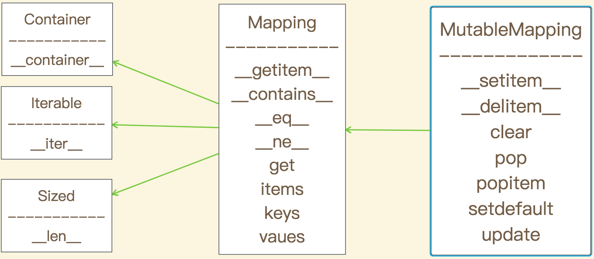

### 字典和散列表

字典类型不但在各种程序里广泛使用，它也是Python语言的基石。模块的命名空间、实例的属性和函数的关键字参数中都可以看到字典的身影。跟它有关的内置函数都在```__bulitins__.dict__```模块中。

正是因为字典至关重要，Python对它实现了高度优化，而散列表则是字典类型性能出众的根本原因。

```collections.abc```模块中有```Mapping```和```MutableMapping```这两个抽象基类，它们的作用是为dict和其他类似的类型定义形式接口（在Python2.6到Python3.2的版本中，这些类还不属于```collections.abc```模块，而是隶属于```collections```模块。）


 

然而，非抽象映射类型一般不会直接继承这些抽象基类，它们会直接对dict或是```collections.User.Dict```进行扩展。这些抽象基类的主要作用是作为形式化文档，它们定义了构建一个映射类型所需要的最基本的接口，然后还可以跟```instance```一起被用来判定某个数据是不是广义上的映射类型：
```
>>> isinstance(my_dict,Mapping)
True
```

注：在Python3.8以后，ABCs将会替代abc
```
>>> from collections import Mapping
__main__:1: DeprecationWarning: Using or importing the ABCs from 'collections' instead of from 'collections.abc' is deprecated, and in 3.8 it will stop working
```

这里用```instance```而不是```type```来检查某个参数是否为dict类型，因为这个参数可能不是dict，而是一个比较另类的映射类型。

目前，标准库里所有的映射类型都是利用dict来实现的，因此他们有个共同的限制，即只有可散列的数据类型才能用作这些映射的键（只有键有这个要求，值并不需要是可散列的数据类型）。
注：什么是可散列的数据类型？
>如果一个对象是可散列的，那么在这个对象的生命周期中，它的散列值是不变的，而且这个对象需要实现```__hash()__```方法。另外可散列对象还要有```__qe__()```方法，这样才能跟其他键作比较。如果两个可散列对象是想等的，那么他们的散列值一定是一样的。
原子不可变数据类型（str、bytes和数值类型）都是可散列类型，```frozenset```也是可散列的，因为根据其定义，```frozenset```里只能容纳可散列类型。元祖的话，只有当一个元祖包含的所有元素都是可散列类型的情况下，它才是可散列的。
```
>>> tt = (1, 2, (30, 40))
>>> hash(tt)
8027212646858338501
>>> tl = (1, 2, [30, 40])
>>> hash(tl)
Traceback (most recent call last):
  File "<stdin>", line 1, in <module>
TypeError: unhashable type: 'list'
>>> tf = (1, 2, frozenset([30, 40]))
>>> hash(tf)
-4118419923444501110
```

在Python中，list是不可散列的，所以它不能作为字典的键。为什么这样说呢？

首先我们来看看字典的工作原理：

字典就是将其`键`映射到`值`上，为了实现这个功能，Python需要做到通过给出的`key`精确的找到`value`。那么怎么实现这个功能呢？

首先考虑一种简单的算法，将每一个键值放在一个列表里面，每次去拿键的时候都要遍历所有的列表来得到`key`和`value`，然后通过对比`key`来得到`value`。这种算法在数据量较小的时候还尚可，但是我们都知道Python的执行效率是比较低下的，所以在数据量变大的时候该算法效率就会变得无法忍受。所以Python采用了`hash`算法来做这样的事情。

Python要求每一个存放在字典中的对象都必须是可散列的，都能实现`hash`函数，通过`hash`函数可以得到一个哈希值，通过这个哈希值，Python可以快速确定对象在字典中的位置。不过仅仅是通过`key`来确定位置是不准确的，因为不同的`key`可能会产生相同的哈希值（哈希冲突），所以校验`value`也是有必要的。所以字典的查询过程大概分为以下三步：

 1. 生成`key`的哈希值。
 2. 通过哈希值来确定对象的位置，这里确定的位置是存放着对象的数组，当然，理想情况下这个数组里面只有一个对象。
 3. 遍历这个数组，找到目标`key`,返回对应的`value`。

这里如果两个`value`的哈希值是不同的，那么他们`key`的哈希值也必然是不同的，否则对象相同，`value`却不同，会导致数据结构混乱。相反，如果两个`key-vaue`是相等的，那么这两个对象也是相等的，这样做是为了尽量保证每个数组里面只有一个元素，提高执行效率。

那么回到最初的话题，为什么list是不能作为字典的键的？

因为字典是不可以被哈希的，如下：

```
>>> a = [3,4]
>>> id(a)
4501650312
>>> hash(a)
Traceback (most recent call last):
  File "<stdin>", line 1, in <module>
TypeError: unhashable type: 'list'
``` 

那么为什么list不能被哈希呢？首先list是可变的，如果我们对list做修改，那么它原来存放位置的哈希值就不能再用了。其次，因为`hash`是基于`id`的，但是相同的list可能会产生不同的`id`,所以字典仍然会把相同值的`key-value`当做不同的对象，这就不满足上面的条件。

由于字典使用了散列表，而散列表又必须是稀疏的，这导致它在空间上的效率低下。举例而言，如果你需要存放数量巨大的记录，那么放在由元祖或是具名元祖构成的列表中会是比较好的选择；最好不要根据JSON的风格，用由字典组成的列表来存放这些记录。用元祖取代字典就能节省空间的原因有两个：其一是避免了散列表消耗的空间，其二是无需把记录中字段的名字在每个元素里都存一遍。

不要对字典同时进行迭代和修改。如果想扫描并修改一个字典，最好分成两步来进行：首先对字典迭代，以得出需要添加的内容，把这些内容放在一个新字典里；迭代结束之后再对原有字典进行更新。因为无论何时往字典里添加新的键，Python解释器都可能做出为字典扩容的决定，扩容会新建一个更大的散列表，并数据迁移，这个过程中可能发生新的散列冲突，导致新散列表中键的次序发生变化。如果在迭代字典的键的过程中同时进行修改，这个循环可能会跳过一些键--甚至是跳过那些字典中已有的键。

常见的几种字典生成方法：
```
>>> a = dict(one=1, two=2, three=3)
>>> b = {'one': 1, 'two': 2, 'three': 3}
>>> c = dict(zip(['one', 'two', 'three'], [1, 2, 3]))
>>> d = dict([('two', 2), ('one', 1), ('three', 3)])
>>> e = dict({'three': 3, 'one': 1, 'two': 2})
>>> a == b == c == d == e
True
```

### 字典类型

#### collections.OrderedDict

>Return an instance of a dict subclass, supporting the usual dict methods. An OrderedDict is a dict that remembers the order that keys were first inserted. If a new entry overwrites an existing entry, the original insertion position is left unchanged. Deleting an entry and reinserting it will move it to the end.                                               
																	 --[Python官方文档](https://docs.python.org/3/library/collections.html#collections.OrderedDict)

`OrderedDict`是一个记住键首次插入的顺序的字典，返回一个`dict`子类的实例，支持通常的`dict`方法。 如果新条目覆盖现有条目，则原始插入位置保持不变。 删除条目并重新插入它会将其移至最后。
不过个人认为现在这个类型变得有点鸡肋，因为Python3.6对字典实现了改写，现在的字典是一个有序的数据结构，新字典dict() 的内存占用比Python3.5中减少20%到25%，不过这一切在未来可能会变化。

#### collections.defaultdict

`defaultdict`是字典中找不到`key`时候的一种选择，应用场景主要是单纯的取值操作。

用户在创建`defaultdict`对象的时候，就需要给他配置一个为找不到的键创造默认值的方法。具体而言，在实例化一个`defaultdict`的时候，需要给构造方法提供一个可调用对象，这个可调用对象会在`__getitem__`碰到找不到`key`的时候调用，让`__getitem__`返回某种默认值。

比如，我们新建额这样一个字典：`dd=defaultdict(list)`，如果键`new_key`在`dd`中不存在的话，表达式`dd['new_key']`会按照以下的步骤来行事：
 1. 调用`list()`来创建一个新列表。
 2. 把这个新列表作为值，``new_key``作为键，放到`dd`中。
 3. 返回这个列表的引用。

而这个用来生成默认值的可调用对象存放在名为`default_factory`的实例属性里。

```
>>> from collections import defaultdict
>>> dd = defaultdict(list)
>>> dd['a']= 1
>>> dd['b'] = 2 
>>> dd['c'] = 3
>>> dd['d']
[]
>>> dd
defaultdict(<class 'list'>, {'a': 1, 'b': 2, 'c': 3, 'd': []})
```
如果在创建`defaultdict`的时候没有指定`default_factory`，查询不存在的键会触发`KeyError`。另外，`defaultdict`里的`default_factory`只会在`__getitem__`里被调用，在其他地方完全不会发挥作用。比如,`dd[key]`会调用这个方法，而`dd.get(key)`则会返回`None`。

最后，我们都知道可以使用`dd.get(key,value)`代替`dd[key]`，给找不到的键一个默认的返回值，但是要更新某个键对应的值得时候，不管使用`__getitem__`还是`get`都会不自然，而且效率低下，Python提供了一个`seatdefault`的方法。
```
my_dict.setdefault(key, []).append(new_value)
```

等效于

```
if key not in my_dict:
    my_dict[key] = []
my_dict[key].append(new_value)
```

二者的效果是一样的，只不过后者至少要进行两次键查询--如果键不存在的话，就是三次，用`setfault`只需要一次就可以完成整个操作，它更适用于通过查找键来插入新值。

`defaultdict`和`setdefault`的区别：如果查询的键不存在default会创建一个新的列表并放入dict中，而`setdefault`只会在查询这个键的时候才会调用。

`collection.defaultdict(list)` ------>在创建字典的时候定义。

`my_dict.setdefault(key,[])` ------>在查询这个键的时候定义,一般使用这种

 方法| dict | defaultdict | OrderedDict |描述
----|----|----|----|----
d.clear() | . | .| . | 移除所有元素 
d.__contains__(k) | . | . | . | 检查k是否在d中  
d.copy() | . | .| . | 浅复制 
d.__copy__() |  | .|  | 用于支持copy.copy 
d.default_factory |  | .|  | 在`__missing__`函数中被调用的函数，用以给未找到的元素设置值 
d.__delitem__(k) | . | .| . | del d[k],移除键为k的元素 
d.fromkeys(it, [initial]) | . | .| . | 将迭代器it里的元素设置为映射里的键，如果有initial参数，就把它作为这些键对应的值（默认是None） 
d.get(k, [default]) | . | .| . | 返回键k对应的值，如果字典里没有键k，则返回None或者default 
d.__getitem__(k) | . | .| . | 让字典d能用d[k]的形式返回k对应的值 
d.items() | . | .| . | 返回d里所有的键值对 
d.__iter__() | . | .| . | 返回键的迭代器 
d.keys() | . | .| . | 返回所有的键 
d.__len__() | . | .| . | 可以用len(d)的形式得到字典里键值对的数量 
d.__missing__(k) |  | .|  | 当__getitem__找不到对应键的时候，这个方法会被调用 
d.move_to_end(k, [last]) |  | | . | 把键为k的元素移动到最靠前或者最靠后的位置（last的默认值是True） 
d.pop(k,[default]) | . | .| . | 返回键k所对应的值，然后移除这个键值对。如果没有这个键，返回None或者default 
d.popitem() | . | . | . |随机返回一个键值对并从字典里移除它 
d.__reversed__() |  | | . | 返回倒序的键的迭代器 
d.setdefault(k, [default]) | . | .| . | 若字典里有键k，则把它对应的值设为default，然后返回这个值；若无，则让d[k]=default，然后返回default 
d.__setitem__(k, v) | . | .| . | 实现d[k]=v操作，把k对应的值设为v 
 d.update(m, [**kargs]) | . | . | . | m可以是映射或者键值对迭代器，用来更新d里对应的条目 
d.value() | . | .| . | 返回所有的值 

*`default_factory`并不是一个方法，而是一个可调用对象(callable),它的值在`defaultdict`初始化的时候由用户设定。


### MappingProxyType不可变映射类型

从Python3.3开始，types模块中引入了一个封装名叫MappingProxyType。如果给这个类一个映射，他会返回一个只读的映射视图。虽然是个只读视图，但是他是动态的。这意味着如果对原映射做出了改动，我们通过则合格视图可以观察到，但是无法通过这个视图对原映射做出修改。

```
>>> from types import MappingProxyType
>>> d = {1:'a'}        #  定义一个映射
>>> d_proxy = MappingProxyType(d)   # 定义一个只读的映射视图
>>> d_proxy
mappingproxy({1: 'a'})
>>> d_proxy[2] = 'b'    # 尝试对视图进行修改
Traceback (most recent call last):
  File "<stdin>", line 1, in <module>
TypeError: 'mappingproxy' object does not support item assignment
>>> d[2] = 'b' 
>>> d_proxy  
mappingproxy({1: 'a', 2: 'b'})    # 原映射改变后视图也发生改变
>>> d_proxy[2]
'b'
```


